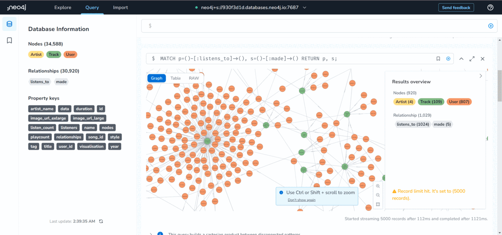
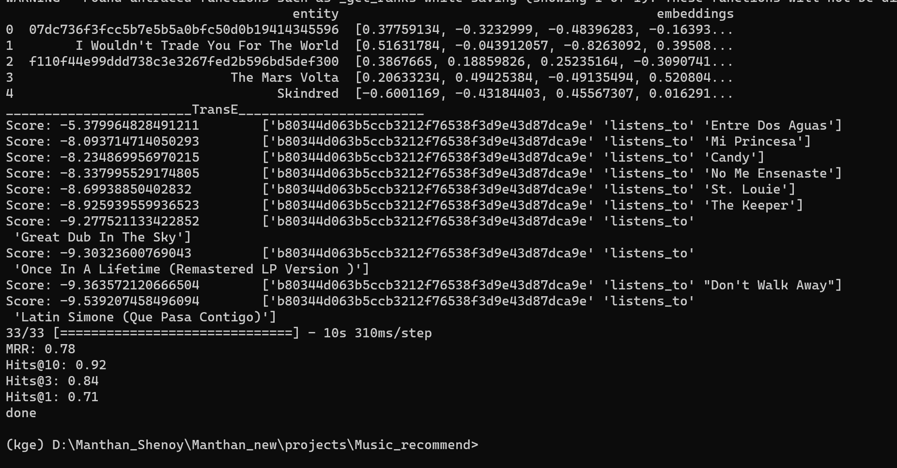

https://github.com/sohebT/kg-music-recommendation/assets/87582800/7517c05f-9e00-4663-937b-d483dda48051

#content-based filtering #collabrative filtering

# Kg-recommendation
The data gathered regarding the music tracks were used to create a knowledge graph (KG) encapsulating the various relations between the tracks, their artist, genre, etc.
The graph is traversed in two ways, one via the listeners and another one via the genres, for recommending tracks to the user

For recommending new tracks to users using the KG, the KG embeddings were created using the TransE scoring function.
It resulted in an MRR score of 0.78, which indicates that the embeddings created for each node are able to capture their relations with other nodes very strongly.

Once we get the input title track, the embeddings are used to find the top 3 listeners that result in the highest score from the scoring function. This means that the embedding model trained considers these three listeners to have the highest possibility of having listened to this track. After that the tracks that these listeners have listened 
to are recommended as output. This approach is similar to collaborative filtering but done via KG embeddings. A similar approach is used to mimic content-based filtering but instead of listeners top 3 matching genres are selected. As these KG embeddings are created using the entire graph, the recommendations we get are influenced by all the relations that the track node has and not just the path it took (listeners and users) in the 2 approaches. 

